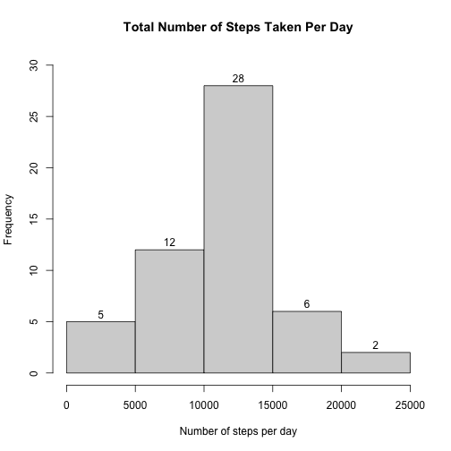
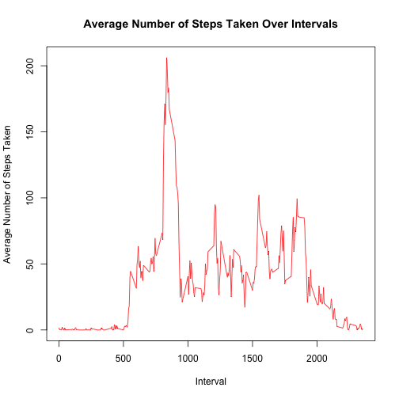
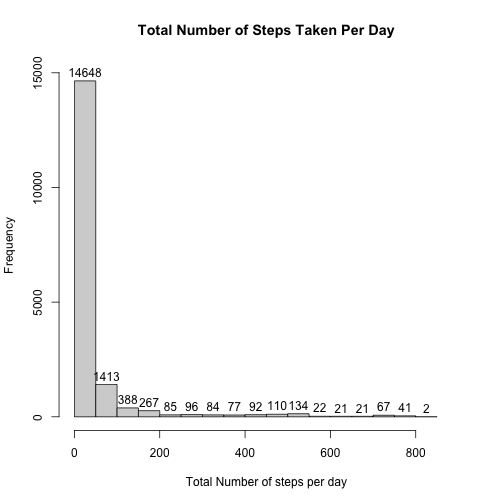
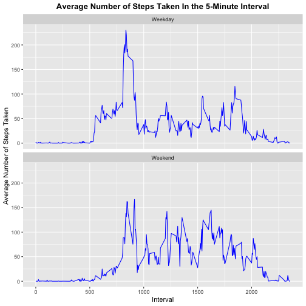

<br>


## Loading and preprocessing the data
<br>
**1. *Load the data (i.e. `read.csv()`)* **

```r
unzip('activity.zip')
activity_data <- read.csv('activity.csv')
```
<br>
**2. *Process/transform the data (if necessary) into a format suitable for your analysis* **

```r
# Remove all instances of NA (missing values) from the dataset
activity_data_complete <- na.omit(activity_data)
head(activity_data_complete)
```

```
##     steps       date interval
## 289     0 2012-10-02        0
## 290     0 2012-10-02        5
## 291     0 2012-10-02       10
## 292     0 2012-10-02       15
## 293     0 2012-10-02       20
## 294     0 2012-10-02       25
```
&nbsp;

## What is mean total number of steps taken per day?
<br>
**1. *Calculate the total number of steps taken per day* **

```r
total_steps_per_day <- activity_data_complete[,c('date','steps')]
total_steps_per_day <- aggregate(total_steps_per_day$steps, list(total_steps_per_day$date), sum)
total_steps_per_day
```

```
##       Group.1     x
## 1  2012-10-02   126
## 2  2012-10-03 11352
## 3  2012-10-04 12116
## 4  2012-10-05 13294
## 5  2012-10-06 15420
## 6  2012-10-07 11015
## 7  2012-10-09 12811
## 8  2012-10-10  9900
## 9  2012-10-11 10304
## 10 2012-10-12 17382
## 11 2012-10-13 12426
## 12 2012-10-14 15098
## 13 2012-10-15 10139
## 14 2012-10-16 15084
## 15 2012-10-17 13452
## 16 2012-10-18 10056
## 17 2012-10-19 11829
## 18 2012-10-20 10395
## 19 2012-10-21  8821
## 20 2012-10-22 13460
## 21 2012-10-23  8918
## 22 2012-10-24  8355
## 23 2012-10-25  2492
## 24 2012-10-26  6778
## 25 2012-10-27 10119
## 26 2012-10-28 11458
## 27 2012-10-29  5018
## 28 2012-10-30  9819
## 29 2012-10-31 15414
## 30 2012-11-02 10600
## 31 2012-11-03 10571
## 32 2012-11-05 10439
## 33 2012-11-06  8334
## 34 2012-11-07 12883
## 35 2012-11-08  3219
## 36 2012-11-11 12608
## 37 2012-11-12 10765
## 38 2012-11-13  7336
## 39 2012-11-15    41
## 40 2012-11-16  5441
## 41 2012-11-17 14339
## 42 2012-11-18 15110
## 43 2012-11-19  8841
## 44 2012-11-20  4472
## 45 2012-11-21 12787
## 46 2012-11-22 20427
## 47 2012-11-23 21194
## 48 2012-11-24 14478
## 49 2012-11-25 11834
## 50 2012-11-26 11162
## 51 2012-11-27 13646
## 52 2012-11-28 10183
## 53 2012-11-29  7047
```
<br>
**2. *If you do not understand the difference between a histogram and a barplot, research the difference between them. Make a histogram of the total number of steps taken each day* **

```r
names(total_steps_per_day) <- c('Date','Total Number of Steps')
hist(total_steps_per_day$`Total Number of Steps`, xlab = 'Number of steps per day', main = 'Total Number of Steps Taken Per Day', ylim = c(0,30), label = TRUE)
```


<br>
**3. *Calculate and report the mean and median of the total number of steps taken per day* **


```r
mean_total_steps <- format(mean(total_steps_per_day$`Total Number of Steps`), scientific=F)
```


```r
median_total_steps <- median(total_steps_per_day$`Total Number of Steps`)
```

Based on the calculations above, we can determine that the mean and median of the total number of steps taken per day are 10766.19 and 10765 respectively.
&nbsp;

## What is the average daily activity pattern?
<br>
**1. *Make a time series plot (i.e. type = 'l') of the 5-minute interval (x-axis) and the average number of steps taken, averaged across all days (y-axis)* **

```r
# Only extract "interval" and "Emissions" column from the original dataset
interval_avg_num_of_steps <- activity_data_complete[,c('interval','steps')]

# Using aggregate() to compute the mean of steps taken (grouped by the respective 5 minute interval identifier)
interval_avg_num_of_steps <- aggregate(interval_avg_num_of_steps$steps, list(interval_avg_num_of_steps$interval), mean)
names(interval_avg_num_of_steps) <- c('Interval','Average Number of Steps Taken')

# Plot interval identifier (x-axis) vs average number of steps (y-axis)
plot(interval_avg_num_of_steps$Interval, interval_avg_num_of_steps$`Average Number of Steps Taken`, type = 'l', main = 'Average Number of Steps Taken Over Intervals', xlab = 'Interval', ylab = 'Average Number of Steps Taken', col = 'red')
```


<br>
**2. *Which 5-minute interval, on average across all the days in the dataset, contains the maximum number of steps?* **

```r
max_num_steps <- max(interval_avg_num_of_steps$`Average Number of Steps Taken`)
num_interval <- grep(max_num_steps, interval_avg_num_of_steps$`Average Number of Steps Taken`)
interval <- interval_avg_num_of_steps$Interval[num_interval]
```

As a result, it is determined that, on average across all the days in the dataset, the 104$^{th}$ 5-minute interval (with identifier 835) would contain the maximum average number of steps (206.1698113 steps).

## Inputing missing values
<br>
Note that there are a number of days/intervals where there are missing values (coded as NA). The presence of missing days may introduce bias into some calculations or summaries of the data. 
<br><br>
**1. *Calculate and report the total number of missing values in the dataset (i.e. the total number of rows with NAs)* **

```r
number_of_missing_rows <- sum(is.na(activity_data))
```
It appears that we have 2304 missing rows in the dataset. 
<br><br>
**2. *Devise a strategy for filling in all of the missing values in the dataset. The strategy does not need to be sophisticated. For example, you could use the mean / median for that day, or the mean for that 5-minute interval, etc.* **
<br>
A viable strategy would be to replace the missing values with the mean for that 5-minute interval (after the missing values are removed).
<br><br>
**3. *Create a new dataset that is equal to the original dataset but with the missing data filled in* **
<br>

```r
# Create another copy of the dataset to contain all the updated values
activity_data_without_NA <- activity_data
i = 0
# set up a while loop to keep track of the intervals to go through (0, 5, 10 etc.)
while (i <= 2355){
  # for each of the intervals, look for entries where the value of steps is missing and save the corresponding mean       under a new variable
  interval_mean <- interval_avg_num_of_steps[interval_avg_num_of_steps$Interval== i, 2]
  # replace the missing values with the mean corresponding to that 5-minute interval
  activity_data_without_NA[activity_data_without_NA$interval== i & is.na(activity_data_without_NA$steps),1] <-            interval_mean
  i <- i + 5
}

# Quick check to see if all of the missing values are filled
sum(is.na(activity_data_without_NA$steps))
```

```
## [1] 0
```
<br>
**4. *Make a histogram of the total number of steps taken each day and calculate and report the mean and median total number of steps taken per day. Do these values differ from the estimates from the first part of the assignment? What is the impact of inputing missing data on the estimates of the total daily number of steps?* **
<br>

```r
hist(activity_data_without_NA$steps, xlab = 'Total Number of steps per day', main = 'Total Number of Steps Taken Per Day', ylim = c(0,15000), xlim = c(0,900), label = TRUE)
```




Based on the calculations above, the new mean and median are 37.3825996 and 0 respectively. These new values significantly differ from the values in the first part. By replacing the missing values with the means of the respective 5-minute intervals, the histogram becomes significantly right-skewed since most of the new values are smaller than the remaining non-missing values, resulting in a higher count of values in the lower end of the range, hence leading to a zero median and significantly smaller mean.

## Are there differences in activity patterns between weekdays and weekends?
<br>
For this part the `weekdays()` function may be of some help here. Use the dataset with the filled-in missing values for this part.
<br><br>
**1. *Create a new factor variable in the dataset with two levels - 'weekday' and 'weekend' indicating whether a given date is a weekday or weekend day* **
<br>

```r
# Creating an empty character variable to save the factor
weekday_or_weekend <- c()

# Converting all of the dataset dates to as.POSXIct() [date format]
dates_in_new_format <- weekdays(as.POSIXct(activity_data$date))

# Set up a for loop to classify the days based on the day of the week
for (date in dates_in_new_format){
  # If the given date is either Monday, Tuesday, Wednesday, Thursday or Friday, it will be classified as a weekday
  if (date %in% c('Monday', 'Tuesday', 'Wednesday', 'Thursday', 'Friday')){
    weekday_or_weekend <- c(weekday_or_weekend,'Weekday')
  }
  # Otherwise, it will be a weekend
  else{
    weekday_or_weekend <- c(weekday_or_weekend,'Weekend')
  }
}

# Adding the new column to the dataset with the filled-in missing values
activity_data_without_NA <- cbind(activity_data_without_NA, 'Weekday/Weekend' = as.factor(weekday_or_weekend))

# Checking to see if the new variable is of class factor
class(activity_data_without_NA$'Weekday/Weekend') == 'factor'
```

```
## [1] TRUE
```
<br>
**2. *Make a panel plot containing a time series plot (i.e. type = 'l') of the 5-minute interval (x-axis) and the average number of steps taken, averaged across all weekday days or weekend days (y-axis). See the README file in the Github repository to see an example of what this plot should look like using simulated data* **
<br>

```r
# Load ggplot2 library
library(ggplot2)

# Using aggregate() to create a data frame containing the means of number of steps for each interval across weekdays and weekends 
activity_data_without_NA <- aggregate(activity_data_without_NA$steps,list(activity_data_without_NA$`Weekday/Weekend`,activity_data_without_NA$interval),mean)
names(activity_data_without_NA) <- c('DayType','Interval', 'StepAverage')

# Create a ggplot object (lower-level plotting) and inserting additional features to the plot 
ggplot(activity_data_without_NA, aes(Interval,StepAverage)) + geom_line(color='blue') + facet_wrap(DayType~., dir = 'v') + labs(title = 'Average Number of Steps Taken In the 5-Minute Interval') + theme(plot.title = element_text(face = 'bold',hjust = 0.5)) + labs(y = 'Average Number of Steps Taken')
```


